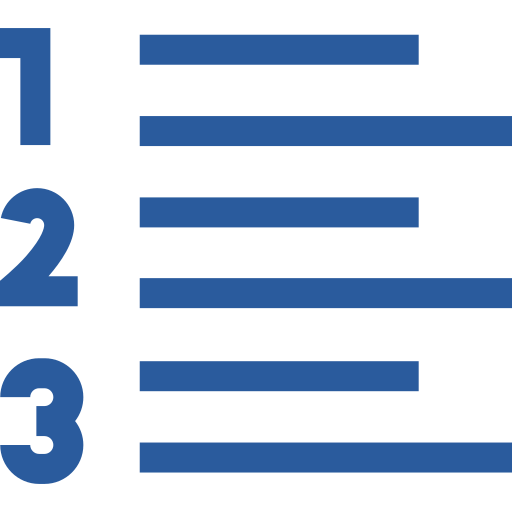

<a name="readme-top"></a>

<div align="center">

  
  <br/>

  <h2><b>Enumerable</b></h2>

</div>
<!-- TABLE OF CONTENTS -->

- [📖 About the Project](#about-project)
  - [🛠 Built With](#built-with)
    - [Tech Stack](#tech-stack)
    - [Key Features](#key-features)
  - [🚀 Live Demo & Project Presentation](#live-demo)
- [💻 Getting Started](#getting-started)
  - [Setup](#setup)
  - [Prerequisites](#prerequisites)
  - [Install](#install)
  - [Usage](#usage)
  - [Run tests](#run-tests)
  - [Deployment](#triangular_flag_on_post-deployment)
- [👥 Authors](#authors)
- [🔭 Future Features](#future-features)
- [🤝 Contributing](#contributing)
- [⭐️ Show your support](#support)
- [🙏 Acknowledgements](#acknowledgements)
- [📝 License](#license)

<!-- PROJECT DESCRIPTION -->

# 📖 Enumerable <a name="about-project"></a>


**Enumerable** in this project we learn how to use a module inside class. For this we create a class MyList and a module MyEnumerable. Our module MyEnumerable implement a subset of the functionality of Enumerable.


## 🛠 Built With <a name="built-with"></a>

### Tech Stack <a name="tech-stack"></a>

<details>
  <summary>Functionality</summary>
  <ul>
    <li><a href="https://www.ruby-lang.org/en/documentation/">Ruby</a></li>
  </ul>
</details>

<!-- Features -->

### Key Features <a name="key-features"></a>

- **Simple to use**
- **Can decode single character or a word or a line**

<p align="right">(<a href="#readme-top">back to top</a>)</p>


<!-- GETTING STARTED -->

## 💻 Getting Started <a name="getting-started"></a>
To get a local copy up and running, follow these steps.
### Prerequisites

In order to run this project you need:

- Ruby

### Setup

Clone this repository to your desired folder:


```cd my-folder   
    git clone git@github.com:cilfonegabriel/morse-message.git
    cd morse_code
```

### Usage

To run the project use the following commands:
```
ruby morse.rb
```

<!-- AUTHORS -->

## 👥 Author <a name="authors"></a>
👤 **Gabriel Cilfone**
- GitHub: [Gabriel Cilfone](https://github.com/cilfonegabriel)
- LinkedIn: [Gabriel Cilfone](www.linkedin.com/in/gabriel-cilfone/)

👤 **Francisco Quintero**

- GitHub: [@HunterX-7](https://github.com/HunterX-7)
- Twitter: [@franquin07](https://twitter.com/franquin07)
- LinkedIn: [Francisco Quintero](https://www.linkedin.com/in/francisco-asis-quintero-cede%C3%B1o/)

<p align="right">(<a href="#readme-top">back to top</a>)</p>

<!-- FUTURE FEATURES -->

## 🔭 Future Features <a name="future-features"></a>

- [ ] **Create your own enumerable with a nice design**

<p align="right">(<a href="#readme-top">back to top</a>)</p>

<!-- CONTRIBUTING -->
## 🤝 Contributing <a name="contributing"></a>
Contributions, issues, and feature requests are welcome!
Feel free to check the [issues page](https://github.com/cilfonegabriel/enumerable/issues).
<p align="right">(<a href="#readme-top">back to top</a>)</p>
<!-- SUPPORT -->

## ⭐️ Show your support <a name="support"></a>
If you like this project feel free to give it a star.
<p align="right">(<a href="#readme-top">back to top</a>)</p>
<!-- ACKNOWLEDGEMENTS -->

## 🙏 Acknowledgments <a name="acknowledgements"></a>
We would like to thank Microverse for starting us in this project.
<p align="right">(<a href="#readme-top">back to top</a>)</p>
<!-- FAQ (optional) -->

## ❓ FAQ <a name="faq"></a>

- **Can I contribute to the project?**
  - Yes. By all means feel free to clone the repository and make your changes. (Always use a new branch)
- **Can I use this application freely?**
  - You can use the application as long as you give credit where it is needed.
<p align="right">(<a href="#readme-top">back to top</a>)</p>
<!-- LICENSE -->

## 📝 License <a name="license"></a>

This project is [MIT](./LICENSE) licensed.

<p align="right">(<a href="#readme-top">back to top</a>)</p>